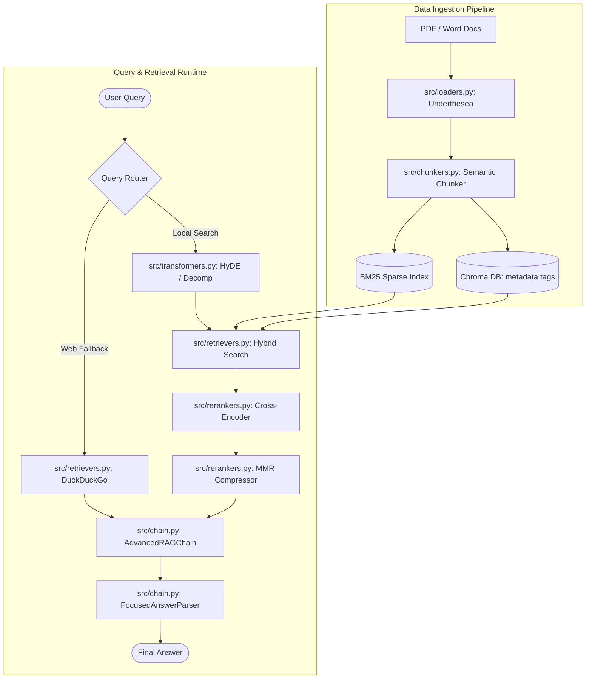

# 🧠 Advanced Vietnamese RAG System with Token Control Pipeline

[](https://www.python.org/downloads/)
[](https://www.docker.com/)
[](https://github.com/gradio-app/gradio)
[](https://opensource.org/licenses/MIT)

Hệ thống Hỏi Đáp Tài Liệu Tiếng Việt Nâng Cao (**Advanced RAG**) tích hợp cơ chế **Tối ưu hóa & Kiểm soát Token 4 Giai đoạn** giúp tiết kiệm tới 70% chi phí API. Dự án hỗ trợ Fine-tuning Embedding chuyên biệt cho dữ liệu nội bộ và đánh giá chất lượng tự động bằng framework **RAGAS Benchmark**.

---

## 📐 Kiến trúc Hệ thống (System Architecture)

Hệ thống được thiết kế theo mô hình kiến trúc phân tầng chuẩn Production:



---

## 🔄 Quy trình Kiểm soát & Tối ưu Token 4 Giai đoạn

Nhằm giải quyết bài toán bùng nổ chi phí API LLM trong thực tế, dự án triển khai quy trình kiểm soát token nghiêm ngặt xuyên suốt vòng đời truy vấn:

```mermaid
graph TD
    %% Giai đoạn 1: Ingestion
    subgraph GD 1: Ingestion (Nạp dữ liệu)
        A[Tài liệu gốc] -->|Semantic Chunker / Token Count| B[Đoạn văn ngắn: Max 300-400 tokens]
        B -->|Mã hóa 1 lần| C[(Kho Vector: Tiết kiệm Token Embedding)]
    end

    %% Giai đoạn 2: Routing
    subgraph GD 2: Routing & Transformation (Định tuyến)
        UserQuery([Câu hỏi của User]) --> D{src/router.py: Mô hình Siêu Nhẹ}
        D -->|JSON Schema tối giản| E{Định tuyến thông minh}
        E -->|Local| F[Decomposition: Max 3 câu hỏi phụ]
        E -->|Web| G[DuckDuckGo Search]
    end

    %% Giai đoạn 3: Compression
    subgraph GD 3: Context Compression (Nén ngữ cảnh)
        F --> H[Hybrid Search: Lấy Top 15-20 Chunks]
        H --> I[Rerank: Cross-Encoder Qwen3]
        I --> J[MMR: Nén và Lọc trùng]
        J -->|Cắt tỉa mạnh tay| K[Top 3-5 Chunks tối ưu nhất]
    end

    %% Giai đoạn 4: Generation
    subgraph GD 4: Concise Generation (Sinh câu trả lời)
        K --> L[Strict Prompt: Ép trả lời ngắn gọn]
        L --> M[LLM Sinh: max_new_tokens=450]
        M --> N[FocusedAnswerParser: Lọc bỏ dẫn dắt thừa]
        N --> Final[Câu trả lời tối ưu]
    end
```

---

## ⚡ Các Tính Năng Nổi Bật (Key Features)

*   **Xử lý Tiếng Việt chuyên sâu**: Tích hợp công cụ `underthesea` tách câu ngữ nghĩa, chuẩn hóa Unicode NFC tránh lỗi font tiếng Việt và lỗi tìm kiếm không dấu/có dấu.
*   **Metadata Tagging (Phân loại tài liệu)**: Hỗ trợ dán nhãn tag tự động theo thư mục con hoặc gán tag thủ công khi upload để thực hiện *Pre-filtering* (Lọc nguồn dữ liệu trước khi truy vấn).
*   **Hybrid Search & RRF**: Kết hợp thế mạnh của tìm kiếm từ khóa (BM25 Việt hóa) và tìm kiếm ngữ nghĩa (Chroma Vector DB) thông qua thuật toán gộp kết quả RRF (Reciprocal Rank Fusion) hoặc Interleaving.
*   **Embedding Fine-Tuning**: Tự động sinh tập dữ liệu câu hỏi giả định (Synthetic Dataset) từ chính tài liệu của bạn qua LLM và tiến hành huấn luyện lại (fine-tune) mô hình Embedding cục bộ để tăng chỉ số **Hit Rate** và **MRR**.
*   **Chấn chỉnh LLM dài dòng**: Chế độ lọc `FocusedAnswerParser` tự động cắt bỏ những câu mở đầu mang tính lặp lại của LLM (như *"Dựa vào tài liệu được cung cấp..."*) và định dạng lại văn bản sạch đẹp.
*   **Đánh giá RAGAS Benchmark**: Theo dõi vết hoạt động log trace của RAG và chạy tự động chấm điểm chất lượng (Faithfulness, Answer Relevancy, Context Precision, Context Recall) bằng các metric Ragas.

---

## ⚙️ Cấu Trúc Mã Nguồn

```text
├── Ducument/               # Thư mục chứa tài liệu nguyên bản (PDF/DOCX)
├── chroma_db/              # Thư mục lưu trữ cơ sở dữ liệu vector Chroma
├── models/                 # Thư mục lưu trữ mô hình Embedding sau fine-tune
├── logs/                   # Logs hội thoại và vết hoạt động phục vụ Ragas
├── src/                    # Thư mục mã nguồn chính (Modularized)
│   ├── loaders.py          # Nạp tài liệu PDF/Word & Chuẩn hóa NFC Tiếng Việt
│   ├── chunkers.py         # Bộ chia văn bản ngữ nghĩa & Đếm token
│   ├── router.py           # Bộ định tuyến thông minh (Local/Web/Hybrid) qua JSON
│   ├── retrievers.py       # Tích hợp VectorDB, BM25 Okapi & DuckDuckGo Search
│   ├── transformers.py     # Biến đổi truy vấn (HyDE sinh tài liệu giả định, Decomposition)
│   ├── rerankers.py        # Tái xếp hạng Cross-Encoder (Qwen3) & MMR
│   ├── finetune_embeddings.py # Tinh chỉnh Embedding & Tính Hit Rate, MRR
│   ├── evaluator.py        # Logs trace hội thoại & Chạy đánh giá Ragas
│   └── chain.py            # Kết nối toàn bộ Pipeline RAG nâng cao
├── app.py                  # Giao diện Gradio tương tác đầy đủ chạy Local/Docker
├── vietnamese_advanced_rag.ipynb # Notebook chạy trực tiếp trên Google Colab
├── requirements.txt        # Các thư viện phụ thuộc của dự án
├── docker-compose.yml      # Cấu hình khởi chạy nhanh Docker Compose
└── Dockerfile              # Thiết lập môi trường ảo hóa Docker
```

---

## 🚀 Hướng Dẫn Khởi Chạy

### 🐳 Cách 1: Chạy cục bộ bằng Docker (Khuyên Dùng)
Tránh xung đột thư viện hệ thống và dễ dàng quản lý tài nguyên.

1.  **Khởi tạo và Build container**:
    ```bash
    docker-compose up --build
    ```
2.  **Truy cập ứng dụng**: Mở trình duyệt và truy cập **`http://localhost:7860`**.

---

### 🐍 Cách 2: Chạy trực tiếp bằng Python (Local)
Yêu cầu Python từ phiên bản **3.10** trở lên.

1.  **Cài đặt thư viện**:
    ```bash
    pip install -r requirements.txt
    ```
2.  **Khởi chạy**:
    ```bash
    python app.py
    ```

---

### 🧪 Cách 3: Chạy trên Google Colab (Mở là Chạy)
Dự án đã tích hợp sẵn tệp Jupyter Notebook tối ưu hóa riêng cho Colab.

1.  Mở Google Colab, bấm tải lên file [vietnamese_advanced_rag.ipynb](file:///D:/Advanced%20RAG/vietnamese_advanced_rag.ipynb).
2.  Điền API Key của bạn (Gemini API Key hoặc OpenAI API Key) vào giao diện và chạy tuần tự các cell.
3.  **Bản vá đã xử lý sẵn**: Notebook đã được tích hợp bản vá tự động giải quyết lỗi xung đột `uvicorn` (`loop_factory`) và lỗi Warning Gradio 6.0 (`css` moved to launch). Bạn không cần chạy lệnh hạ cấp thư viện thủ công nào.

---

## 🛡️ Giấy phép
Dự án được phân phối dưới giấy phép MIT License. Bạn có thể tự do chỉnh sửa và tích hợp vào các dự án thương mại.
